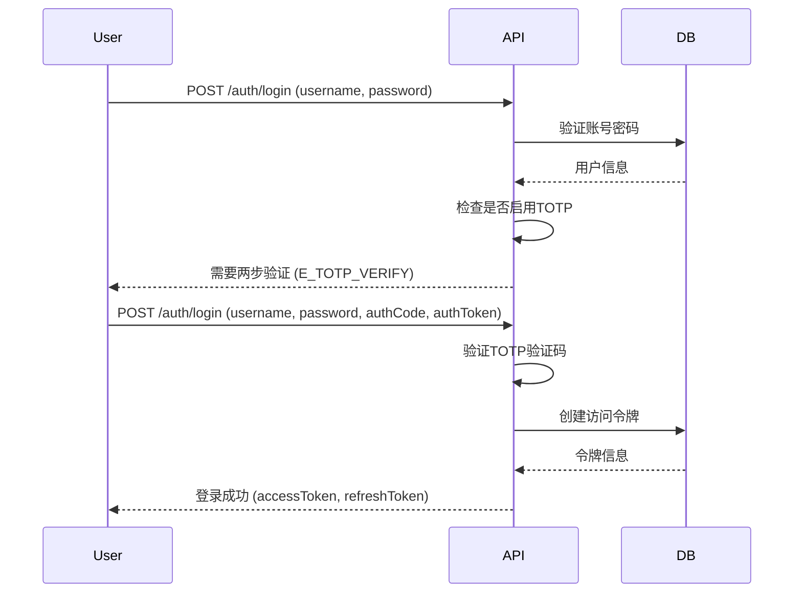

# About

adonis-admin 是一个为 `adonisjs` 设计的后台管理扩展包，提供了完善的 RBAC（基于角色的访问控制）系统和查询辅助工具，帮助开发者快速构建后台管理接口。

**_功能特性_**

- 🎯 **完整的 RBAC 系统** - 用户、角色、菜单、部门多级权限管理
- 🔐 **TOTP 两步验证** - 支持 Google Authenticator 等标准验证器
- 🎫 **Token 管理** - 登录、刷新、注销、多设备管理
- 📦 **查询辅助工具** - 灵活的数据库查询、分页、过滤支持
- 📊 **操作日志** - 自动记录用户操作行为
- 🗂 **数据表迁移** - 自动创建标准化的管理数据表
- ✅ **内置测试** - 完整的功能测试用例

**_系统要求_**

- node >= 24.0.0
- adonisjs >= 7.0.0

# 快速开始

在你的 `adonisjs` 项目中运行配置命令:

```bash
node ace add adonis-admin
node ace admin:install
```

以上命令会先安装依赖，然后执行安装脚本和迁移文件。
安装完成后，你的 `adonisjs` 项目中会自动生成相关的必要文件，以及数据库的数据表和默认数据。
你可以使用 `admin/admin123` 登录到管理后台。

# 基础功能

在你的 `adonisjs` 项目 `controllers/admin/admin_system_controller.ts` 中会自动注册以下路由：

```typescript
// Guest routes (no authentication required)
router.post('auth/tokens', [SystemController, 'login']).as('guest_login')
router.post('auth/tokens/refresh', [SystemController, 'refreshToken']).as('guest_refresh')
router.post('auth/passwords/reset', [SystemController, 'forgotPassword']).as('guest_reset')

// Auth routes (require authentication)
router.get('auth/totp', [SystemController, 'showTotpSecret']).as('admin_totp')
router.get('auth/mine', [SystemController, 'mine']).as('admin_mine')
router.patch('auth/mine', [SystemController, 'updateMine']).as('admin_update_mine')

// Token management
router.get('auth/sessions', [SystemController, 'accessTokens']).as('admin_sessions')
router.delete('auth/sessions/:id', [SystemController, 'outAccessToken']).as('admin_session_delete')

// File upload
router.post('uploads', [SystemController, 'upload']).as('admin_upload')

// Resource management
router.resource('users', UserController).apiOnly().as('admin_user')
router.resource('roles', RoleController).apiOnly().as('admin_role')
router.resource('menus', MenuController).apiOnly().as('admin_menu')
router.resource('depts', DeptController).apiOnly().as('admin_dept')
router.resource('logs', LogController).apiOnly().as('admin_log')
```

## 控制器使用

**_注意_**

- 这些路由是基础功能，你可以根据需要自行扩展。
- 路由必须用 `.as(xxx)` 定义路由名称，路由名称用于 RBAC 的权限配置。
- 如果没有定义路由名称或路由名称以 `guest_` 开头 RBAC 系统将直接允许访问，无需权限验证。

# 创建 CRUD 控制器

当你需要为一个 `Model` 创建 `CRUD` 接口时，你可以执行以下命令：

```bash
node ace admin:resource ModelName
```

以上命令会自动生成一个基于 `ResourceHelper` 的控制器模板，并自动注册路由。

# ResourceHelper 查询辅助工具

`ResourceHelper` 提供了一套简单方便的数据库查询工具，默认主键为 `id`，分页参数为 `page` 和 `perPage`。你可以在实例化时修改这些默认值。

## 支持的查询符号

- `eq` - 等于 (`=`)
- `gt` - 大于 (`>`)
- `lt` - 小于 (`<`)
- `like` - 模糊查询 (`LIKE`)
- `between` - 区间查询 (`BETWEEN`)

## 批量修改和删除

使用 `,` 号分隔多个主键值，批量修改或删除多个记录。

```bash
DELETE /api/user/1,2,3
PUT /api/user/1,2,3
```

## 响应格式

所有请求都要遵守规范，你可以通过以下方式格式化响应：

```typescript
// 成功响应
return resource.success(data, '操作成功')
// 输出: http 状态码 200 { code: 0, message: '操作成功', data: {...} }

// 错误响应
return resource.error('用户不存在', 'E_USER_NOT_FOUND', 404)
// 输出: http 状态码 200 { code: 404, error: 'E_USER_NOT_FOUND', message: '用户不存在' }

// 异常响应
throw new Exception('用户不存在', {status:404,code:'E_USER_NOT_FOUND'})
// 输出: http 状态码 404 { errors : [ {message:'用户不存在',code:'E_USER_NOT_FOUND'} ] }

// 分页响应
return resource.pagination(data, {page:1,perPage:10})
// 输出:
{
  "code": 0,
  "message": "success",
  "data": {
    "meta": {
      "total": 100,
      "perPage": 10,
      "currentPage": 1,
      "lastPage": 10
    },
    "data": [
      // 数据列表
    ]
  }
}
```

### 权限控制

除了中间件，`AdminUser` 模型还提供了多种权限检查方法，用于在控制器中进行权限验证。

```typescript
// 检查用户是否是管理员
const isAdmin = await AdminUser.isAdmin(user)

// 检查用户是否拥有特定角色
const isEditor = await AdminUser.isRole(user, ['editor'])

// 检查用户是否可以访问某个路由
const canAccess = await AdminUser.canAccess(user, 'admin_user_index')

// 获取用户的所有角色
const roles = await AdminUser.getUserRoles(user)

// 获取用户的所有菜单
const menus = await AdminUser.getUserMenus(user)
```

# TOTP 两步验证

系统默认提供 TOTP 两步验证功能，你只需在 `SystemController` 中 `totpEnable=true` 开启即可。

## 两步验证步骤

1. 用户调用 `GET auth/totp` 获取密钥
2. 使用 `Google Authenticator` 扫描返回的 `QRCode`
3. 首次输入账号密码返回 `totp` 状态和密钥
4. 再次请求登录提交账号密码和验证码密钥

```typescript
POST /auth/login
{
  "username": "admin",
  "password": "password123",
  "authCode": "123456",      // TOTP 验证码
  "authToken": "encrypted"   // 加密令牌
}
```

## 两步验证流程



## 数据表结构

以下为系统默认数据库表结构：

### admin_users - 用户表

| 字段        | 类型        | 说明                  |
| ----------- | ----------- | --------------------- |
| id          | increments  | 主键                  |
| username    | string(30)  | 用户名（唯一）        |
| password    | string(180) | 密码（加密）          |
| nickname    | string(30)  | 昵称                  |
| email       | string(60)  | 邮箱                  |
| phone       | string(20)  | 手机号                |
| avatar      | string(120) | 头像URL               |
| sex         | integer     | 性别（0未知 1男 2女） |
| status      | integer     | 状态（0禁用 1启用）   |
| secret      | string(180) | TOTP密钥              |
| permissions | text        | 权限列表              |
| dept_id     | integer     | 部门ID                |
| remark      | string(255) | 备注                  |

### admin_roles - 角色表

| 字段   | 类型        | 说明             |
| ------ | ----------- | ---------------- |
| id     | increments  | 主键             |
| name   | string(30)  | 角色名称         |
| code   | string(30)  | 角色编码（唯一） |
| status | integer     | 状态             |
| remark | string(255) | 备注             |

### admin_menus - 菜单表

| 字段        | 类型       | 说明             |
| ----------- | ---------- | ---------------- |
| id          | increments | 主键             |
| parent_id   | integer    | 父菜单ID         |
| title       | string(30) | 菜单标题         |
| name        | string(30) | 菜单名称         |
| path        | string(56) | 路由路径         |
| icon        | string(56) | 图标             |
| component   | string(56) | 组件名称         |
| permissions | text       | 权限标识(路由名) |
| show        | boolean    | 是否显示         |
| sort        | integer    | 排序             |
| status      | integer    | 状态             |

### admin_depts - 部门表

| 字段      | 类型       | 说明       |
| --------- | ---------- | ---------- |
| id        | increments | 主键       |
| parent_id | integer    | 父部门ID   |
| name      | string(30) | 部门名称   |
| leader    | string(30) | 部门负责人 |
| phone     | string(20) | 联系电话   |
| email     | string(60) | 部门邮箱   |
| sort      | integer    | 排序       |
| status    | integer    | 状态       |

### admin_logs - 操作日志表

| 字段     | 类型        | 说明     |
| -------- | ----------- | -------- |
| id       | increments  | 主键     |
| username | string(30)  | 操作用户 |
| path     | string(120) | 请求路径 |
| method   | string(10)  | 请求方法 |
| params   | text        | 请求参数 |
| headers  | text        | 请求头   |
| status   | integer     | 响应状态 |

## 相关资源

- [AdonisJS 文档](https://docs.adonisjs.com/)
- [Lucid ORM 文档](https://lucid.adonisjs.com/)
